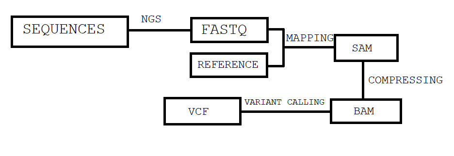
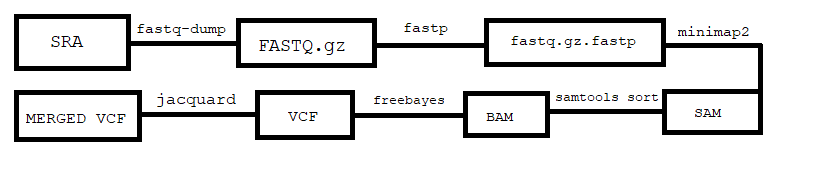

# Genomics Pipeline Introduction Worksheet

<!--- Write name below --->
## Name:
Alex Everett
<!--- For this worksheet, answer the following questions --->

## Q1: What is a bioinformatics pipeline?
Answer:
A sequence of algorithms used to process biological data.

## Q2: What are the three basic filetypes discussed in this repository? What information do they contain?
Answer:
FASTA/FASTQ = Sequence data and quality scores (FASTQ)
SAM = Sequence data aligned to a reference sequence
VCF = Sites of sequence variation

## Q2: What does a general bioinformatics pipeline look like? Draw a schematic of a pipeline (using boxes and arrows) and add the image file name to the <insert-file-name-here> text below (png or jpg will work). Your schematic should include file types, program types (e.g., mapping program), and arrows between file types.

## Q3: Using information from the genomics-pipeline-intro.sh script and [Farkas et al., 2021](https://doi.org/10.3389/fmicb.2021.665041), draw another schematic specific to their study showing file types, program types (use specific program names in this schematic), and arrows between file types. Add the image file name to the <insert-file-name-here> text below.

## Q4: After running the genomics-pipeline-intro.sh script, how many variants are in merged.vcf?
Answer:
1597

## Q5: What is the alternate allele depth of sample SRR11621811|unknown at site 25350 in contig NC_045512.2?
Answer:
N/A (the main BASH script kept throwing errors and wouldn't give me proper VCF files for anything).

## Q6: In what ways would you consider filtering the VCF? In other words, what criteria would you use to remove variants / genotypes from the dataset?
Answer:
Probably the best thing I could think of filtering the VCF for would be based on quality scores. Variants with low quality scores could be removed from the VCF and leave variants more likely to be accurate.
